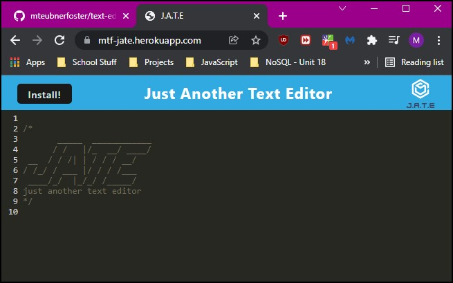

# text-editor

I created a PWA Text Editor that runs in a browser, and can be installed by clicking an 'Install!' button. This app utilizes IndexedDB, Manifest and Webpack. 

## Table of Contents
  
[Description](#Description)
[Technologies](#Technologies)
[Screenshots](#Screenshots)
[Website](#Website)
[Author](#Author)

## Description

Upon visiting the website via Heroku, a user can
1. Write code using the text editor that can function offline
2. Install the text editor that builds a shortcut onto a local system's desktop
3. Use JATE on a local system upon install

## Technologies
- [Webpacks](https://webpack.js.org/)
- [Node](https://nodejs.org/en/)
- [Express](https://www.npmjs.com/package/express)
- [Babel](https://babeljs.io/docs/en/babel-node)
- [Workbox](https://www.npmjs.com/package/workbox-webpack-plugin)
- [Heroku](https://www.heroku.com)
- [JawsDB](https://www.jawsdb.com/)

## Screenshot

## Website
Check out the [live app](https://mtf-jate.herokuapp.com/)!

## Author
[Megan Teubner-Foster](https://mteubnerfoster.github.io/mtf-portfolio/)